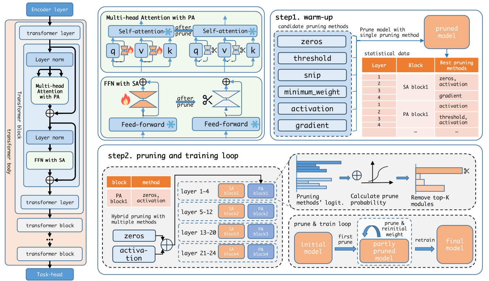

  <h3 align="center">PrunePEFT code</h3>
  

    PrunePEFT: Adaptive Hybrid Pruning for Parameter-Efficient Fine-tuning of
Large Pre-trained Language Models
  

### Context

- [Context](#context)
- [Quick Start](#quick-start)
  - [create environment](#create-environment)
  - [dataset download](#dataset-download)
  - [file tree](#file-tree)
- [Run](#run)

### Quick Start

##### create environment

`conda create -n prunepeft python=3.10`

`conda activate prunepeft`

`pip install -r requirement.txt`

##### dataset download

run code in `glue_dataset.ipynb` to download GLUE dataset.

## Run

- Run lora baseline on glue benchmark.

`python tools/controller.py --method method_configs/lora.yaml --task task_configs/glue_full_base.yaml --device 0`

- Run dynamic block prune on glue benchmark.

`python tools/controller.py --method method_configs/adapter_lora.yaml --task task_configs/glue_full_block.yaml --device 0`

- Run single pruning method on glue benchmark.

`python tools/controller.py --method method_configs/adapter_lora.yaml --task task_configs/glue_full.yaml --device 0`

device: the GPU id to use.
